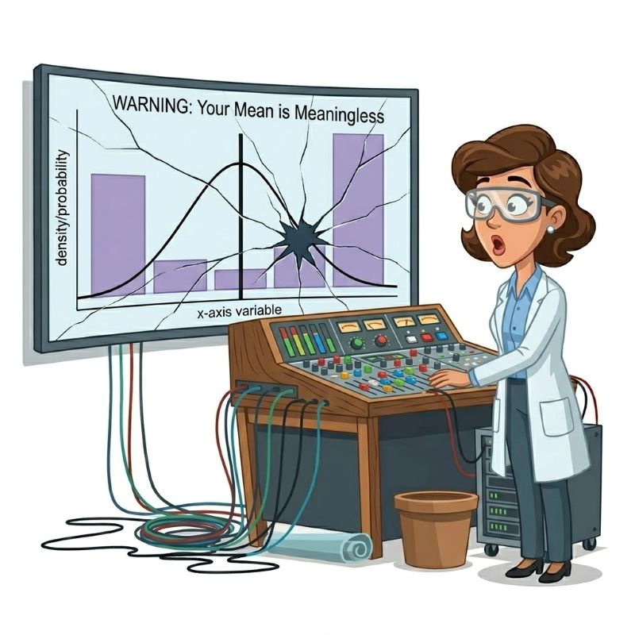

## Preamble

In [Part 1](https://reluctantcriminologists.com/blog-posts/016/part1-mean-meaningless), we argued that running linear regression on an ordinal outcome quietly commits you to an estimand — the conditional mean — that often fails to summarize what you actually care about. We walked through a pre–post comparison of two AI coding assistants (Model A and Model B), where Model B polarized users in opposite directions along an observable prompt-length covariate. Ignoring prompt length, Model A and Model B had identical average satisfaction. Conditioning on prompt length, three models produced different stories about the direction and magnitude of the change: OLS compressed the decision-relevant distributional shifts by roughly half and even got the *sign* wrong in the off-diagonal cells; the proportional-odds cumulative probit (PO probit or PO CP) recovered the distributional shape better but still came in 8 to 10 percentage points shy at the tails; the category-specific cumulative probit (CS probit or CS CP) matched the observed cell distributions exactly, producing accurate probability contrasts with uncertainty-communicating 95% CIs, *p*-values, and plots ready to hand to a non-technical collaborator. Part 1 also added formal model-fit comparisons that ranked the three models in the same order as the contrast table (OLS < PO probit < CS probit).

In this post, we give you control of the data and modeling features. Below is an interactive tool[^posit-cloud] for generating your own ordinal two-condition (aka two treatment arms) comparisons. You can dial the sample size, pick a shape for the baseline response distribution, set the effect size, turn a proportional-odds violation on and off, and optionally fit a category-specific cumulative probit alongside OLS and the PO probit. The app simulates the data, fits the models, and overlays their predicted category probabilities on the observed distribution, with 95% CIs on the per-category contrasts and AIC / BIC on a common categorical scale.

[^posit-cloud]: The interactive tool is a Shiny app hosted on [Posit Connect Cloud](https://connect.posit.cloud/) and embedded in the post via `<iframe>`. See the hosting-note footnote on the next paragraph for cold-start behavior and how to clone the source.

Our goal is not to walk you through the math again — Part 1 did that. Rather, it is to let you develop a feel for how the choice of model matters under various conditions. The five guided tours below point to canned settings that illustrate various failure modes mentioned in Part 1, plus a bimodal-baseline counterfactual tour that goes beyond Part 1 by showing how OLS in-sample failures are exacerbated when predicting out-of-sample (here, under counterfactual extrapolation). We render each tour's expected output as a static figure so you can read the post end-to-end without waiting on the live app to load. But you are not limited to the canned settings; the dashboard lets you take control and examine your own modeling choices and distributional assumptions.

The app's covariate support is limited to a single binary subgroup toggle (the *Include subgroup covariate* checkbox, used in [Tour 2](#sec-tour2) below to recreate Part 1's polarization-by-prompt-length pattern in microcosm). It does not let you simulate continuous, multiple, or differently-named covariates of your own design — adding those dimensions would explode the UI surface, and for those cases the code patterns in the [Bring your own data](#sec-byod) section below should help you translate directly to your own data frame.

A brief methodological note before we start. The app uses frequentist models (`lm` for linear, `MASS::polr` for the PO probit, `ordinal::clm` for the category-specific probit, and `ordinal::clm` with a `scale = ~ treatment` term for the heteroscedastic PO probit) rather than Bayesian ones, and pulls 95% CIs for the category-level contrasts from [`marginaleffects`](https://marginaleffects.com). I (Jon) wanted the app to be fast and to use a minimal set of R packages so it could be hosted on a free public-Shiny tier. For production applied work, we would still reach for a Bayesian multilevel cumulative probit (see our [JQC paper](https://doi.org/10.1007/s10940-025-09627-5) and [online supplement](https://reluctantcriminologists.com/supp/bd-supp/)), but for building intuition `polr`, `clm`, and `marginaleffects` are plenty.[^hosting-note]

[^hosting-note]:
    The app is a standard server-side Shiny app, hosted free on Posit Connect Cloud. If the iframe is slow to come up, that is a cold start — the host puts the app to sleep when idle and spins it back up on demand. Refreshing usually fixes it. The full source is in `shiny/app.R` alongside the post; you can also clone and run it locally with `shiny::runApp("shiny/app.R")`.

```{r}
#| label: setup
#| include: false

library(ggplot2)
library(dplyr)
library(tidyr)
library(MASS)
library(ordinal)
library(marginaleffects)
library(knitr)
library(patchwork)

# URL of the deployed Shiny app on Posit Connect Cloud.
# Replace after first deploy; rendered into the <iframe> below.
app_url <- "https://YOUR-USERNAME.connect.posit.cloud/content/REPLACE-ME/"

# ---- Helpers (kept in sync with shiny/app.R) --------------------------

gen_baseline_probs <- function(shape, K) {
  x <- 1:K
  p <- switch(
    shape,
    "Symmetric / Normal-like"    = dnorm(seq(-1.5, 1.5, length.out = K)),
    "Uniform (flat)"             = rep(1, K),
    "Bimodal (polarized)"        = {
      v <- rep(0.1, K); v[1] <- 1; v[K] <- 1; v
    },
    "Skewed toward Satisfied"    = (x / K)^2,
    "Skewed toward Dissatisfied" = ((K - x + 1) / K)^2,
    "Zero-inflated / J-shape"    = exp(-0.8 * (x - 1))
  )
  p / sum(p)
}

treat_probs <- function(baseline, beta, effect_type, scale_ratio = 1) {
  K   <- length(baseline)
  tau <- qnorm(pmin(pmax(cumsum(baseline)[-K], 1e-4), 1 - 1e-4))

  if (effect_type == "polarize") {
    cum_pos <- c(pnorm((tau - beta) / scale_ratio), 1)
    cum_neg <- c(pnorm((tau + beta) / scale_ratio), 1)
    return(0.5 * diff(c(0, cum_pos)) + 0.5 * diff(c(0, cum_neg)))
  }

  beta_k <- if (effect_type == "asymmetric") {
    beta * seq(2, 0, length.out = K - 1)
  } else {
    rep(beta, K - 1)
  }
  cum_treat <- c(pnorm((tau - beta_k) / scale_ratio), 1)
  diff(c(0, cum_treat))
}

simulate_ab <- function(n_per, K, shape, beta, effect_type,
                        scale_ratio = 1, seed = 1138,
                        covariate = FALSE, interaction_mag = 0) {
  set.seed(seed)
  baseline <- gen_baseline_probs(shape, K)

  if (!covariate) {
    treated <- treat_probs(baseline, beta, effect_type, scale_ratio)
    ctrl <- sample(1:K, n_per, replace = TRUE, prob = baseline)
    trt  <- sample(1:K, n_per, replace = TRUE, prob = treated)
    return(tibble(
      treatment = factor(rep(c("Model A", "Model B"), each = n_per),
                         levels = c("Model A", "Model B")),
      response  = c(ctrl, trt)
    ) %>% mutate(response_ord = factor(response, levels = 1:K, ordered = TRUE)))
  }

  beta_low  <- beta + interaction_mag / 2
  beta_high <- beta - interaction_mag / 2
  n_half    <- n_per %/% 2
  n_other   <- n_per - n_half

  treated_low  <- treat_probs(baseline, beta_low,  effect_type, scale_ratio)
  treated_high <- treat_probs(baseline, beta_high, effect_type, scale_ratio)

  tibble(
    treatment = factor(rep(c("Model A", "Model B"), each = n_per),
                       levels = c("Model A", "Model B")),
    subgroup  = factor(c(rep("low", n_half), rep("high", n_other),
                         rep("low", n_half), rep("high", n_other)),
                       levels = c("low", "high")),
    response  = c(sample(1:K, n_half,  replace = TRUE, prob = baseline),
                  sample(1:K, n_other, replace = TRUE, prob = baseline),
                  sample(1:K, n_half,  replace = TRUE, prob = treated_low),
                  sample(1:K, n_other, replace = TRUE, prob = treated_high))
  ) %>% mutate(response_ord = factor(response, levels = 1:K, ordered = TRUE))
}

fit_models <- function(sim, fit_cs = FALSE, fit_scale = FALSE, covariate = FALSE) {
  if (covariate) {
    f_ols <- response ~ treatment * subgroup
    f_pol <- response_ord ~ treatment * subgroup
    f_cs  <- ~ treatment * subgroup
  } else {
    f_ols <- response ~ treatment
    f_pol <- response_ord ~ treatment
    f_cs  <- ~ treatment
  }
  m_ols <- lm(f_ols, data = sim)
  m_ord <- tryCatch(
    polr(f_pol, data = sim, method = "probit", Hess = TRUE),
    error = function(e) NULL
  )
  m_cs <- if (fit_cs) {
    tryCatch(
      clm(response_ord ~ 1, nominal = f_cs, data = sim, link = "probit"),
      error = function(e) NULL
    )
  } else NULL
  m_scale <- if (fit_scale && !fit_cs && !covariate) {
    tryCatch(
      clm(response_ord ~ treatment, scale = ~ treatment,
          data = sim, link = "probit"),
      error = function(e) NULL
    )
  } else NULL
  list(ols = m_ols, ord = m_ord, cs = m_cs, scale = m_scale)
}

interaction_p <- function(model) {
  if (is.null(model)) return(NA_real_)
  cf <- summary(model)$coefficients
  rn <- rownames(cf)
  ix <- grepl(":", rn) & grepl("treatment", rn) & grepl("subgroup", rn)
  if (!any(ix)) return(NA_real_)
  if ("Pr(>|t|)" %in% colnames(cf)) return(unname(cf[ix, "Pr(>|t|)"][1]))
  if ("t value"  %in% colnames(cf)) return(2 * pnorm(-abs(cf[ix, "t value"][1])))
  NA_real_
}

interaction_coef <- function(model) {
  if (is.null(model)) return(NA_real_)
  cf <- summary(model)$coefficients
  rn <- rownames(cf)
  ix <- grepl(":", rn) & grepl("treatment", rn) & grepl("subgroup", rn)
  if (!any(ix)) return(NA_real_)
  est_col <- if ("Estimate" %in% colnames(cf)) "Estimate" else "Value"
  unname(cf[ix, est_col][1])
}

predicted_probs <- function(models, K, covariate = FALSE) {
  newdat <- if (covariate) {
    expand_grid(
      treatment = factor(c("Model A", "Model B"), levels = c("Model A", "Model B")),
      subgroup  = factor(c("low", "high"), levels = c("low", "high"))
    )
  } else {
    tibble(treatment = factor(c("Model A", "Model B"), levels = c("Model A", "Model B")))
  }
  group_keys <- if (covariate) c("treatment", "subgroup") else c("treatment")

  if (!is.null(models$ord)) {
    raw <- predict(models$ord, newdata = newdat, type = "probs")
    preds_ord <- as.data.frame(raw) %>%
      setNames(as.character(1:K)) %>%
      bind_cols(newdat %>% mutate(across(everything(), as.character))) %>%
      pivot_longer(as.character(1:K), names_to = "response", values_to = "p_ord") %>%
      mutate(response = as.integer(response))
  } else {
    preds_ord <- newdat %>%
      mutate(across(everything(), as.character)) %>%
      crossing(response = 1:K) %>%
      mutate(p_ord = NA_real_)
  }

  ols_bin_probs <- function(mu, sig, K) {
    edges <- c(-Inf, seq(1.5, K - 0.5, by = 1), Inf)
    diff(pnorm(edges, mean = mu, sd = sig))
  }
  ols_mu  <- predict(models$ols, newdata = newdat)
  ols_sig <- summary(models$ols)$sigma
  preds_ols <- bind_rows(lapply(seq_len(nrow(newdat)), function(i) {
    row <- newdat[i, , drop = FALSE]
    tibble(
      !!!lapply(row, as.character),
      response = 1:K,
      p_ols    = ols_bin_probs(ols_mu[i], ols_sig, K)
    )
  }))

  if (!is.null(models$cs)) {
    cs_grid <- if (covariate) {
      expand_grid(
        treatment    = factor(c("Model A", "Model B"), levels = c("Model A", "Model B")),
        subgroup     = factor(c("low", "high"), levels = c("low", "high")),
        response_ord = factor(1:K, levels = 1:K, ordered = TRUE)
      )
    } else {
      expand_grid(
        treatment    = factor(c("Model A", "Model B"), levels = c("Model A", "Model B")),
        response_ord = factor(1:K, levels = 1:K, ordered = TRUE)
      )
    }
    preds_cs <- tryCatch({
      cs_grid %>%
        mutate(p_cs = predict(models$cs, newdata = cs_grid, type = "prob")$fit,
               response = as.integer(as.character(response_ord))) %>%
        mutate(across(any_of(c("treatment", "subgroup")), as.character)) %>%
        dplyr::select(any_of(c("treatment", "subgroup", "response", "p_cs")))
    }, error = function(e) {
      newdat %>%
        mutate(across(everything(), as.character)) %>%
        crossing(response = 1:K) %>%
        mutate(p_cs = NA_real_)
    })
  } else {
    preds_cs <- newdat %>%
      mutate(across(everything(), as.character)) %>%
      crossing(response = 1:K) %>%
      mutate(p_cs = NA_real_)
  }

  # Heteroscedastic PO probit (clm with scale = ~ treatment). Only fitted
  # under the no-covariate, no-CS scenario per fit_models above.
  if (!is.null(models$scale)) {
    scale_grid <- expand_grid(
      treatment    = factor(c("Model A", "Model B"), levels = c("Model A", "Model B")),
      response_ord = factor(1:K, levels = 1:K, ordered = TRUE)
    )
    preds_scale <- tryCatch({
      scale_grid %>%
        mutate(p_scale  = predict(models$scale, newdata = scale_grid, type = "prob")$fit,
               response = as.integer(as.character(response_ord))) %>%
        mutate(across(any_of(c("treatment", "subgroup")), as.character)) %>%
        dplyr::select(any_of(c("treatment", "subgroup", "response", "p_scale")))
    }, error = function(e) {
      newdat %>%
        mutate(across(everything(), as.character)) %>%
        crossing(response = 1:K) %>%
        mutate(p_scale = NA_real_)
    })
  } else {
    preds_scale <- newdat %>%
      mutate(across(everything(), as.character)) %>%
      crossing(response = 1:K) %>%
      mutate(p_scale = NA_real_)
  }

  full_join(preds_ord,   preds_ols,   by = c(group_keys, "response")) %>%
    full_join(preds_cs,    by = c(group_keys, "response")) %>%
    full_join(preds_scale, by = c(group_keys, "response"))
}

observed_probs <- function(sim, covariate = FALSE) {
  group_keys <- if (covariate) c("treatment", "subgroup") else c("treatment")
  sim %>%
    count(across(all_of(c(group_keys, "response")))) %>%
    group_by(across(all_of(group_keys))) %>%
    mutate(p_obs = n / sum(n)) %>%
    ungroup() %>%
    mutate(across(all_of(group_keys), as.character)) %>%
    dplyr::select(all_of(c(group_keys, "response", "p_obs")))
}

contrast_cis <- function(models, K, covariate = FALSE) {
  ci_src <- if (!is.null(models$cs)) models$cs else models$ord
  if (is.null(ci_src)) {
    cols <- if (covariate) {
      tibble(subgroup = rep(c("low", "high"), each = K),
             response = rep(1:K, 2))
    } else {
      tibble(response = 1:K)
    }
    return(cols %>% mutate(estimate = NA_real_, conf.low = NA_real_, conf.high = NA_real_))
  }
  me_type <- if (inherits(ci_src, "polr")) "probs" else "prob"
  tryCatch({
    out <- if (covariate) {
      avg_comparisons(ci_src, variables = "treatment", by = "subgroup", type = me_type)
    } else {
      avg_comparisons(ci_src, variables = "treatment", type = me_type)
    }
    out <- out %>%
      as_tibble() %>%
      mutate(response = suppressWarnings(as.integer(as.character(group))))
    if (covariate) {
      out %>% dplyr::select(subgroup, response, estimate, conf.low, conf.high) %>%
        mutate(subgroup = as.character(subgroup))
    } else {
      out %>% dplyr::select(response, estimate, conf.low, conf.high)
    }
  }, error = function(e) {
    cols <- if (covariate) {
      tibble(subgroup = rep(c("low", "high"), each = K),
             response = rep(1:K, 2))
    } else {
      tibble(response = 1:K)
    }
    cols %>% mutate(estimate = NA_real_, conf.low = NA_real_, conf.high = NA_real_)
  })
}

# Static-render version of the app's "Distributions" plot.
# `sim` and `models` should match the same simulation (same covariate flag).
make_dist_plot <- function(sim, models, K, fit_cs, fit_scale = FALSE, covariate = FALSE) {
  preds_df <- predicted_probs(models, K, covariate = covariate)
  obs_df   <- observed_probs(sim,   covariate = covariate)
  group_keys <- if (covariate) c("treatment", "subgroup") else c("treatment")
  dat <- full_join(obs_df, preds_df, by = c(group_keys, "response"))

  cs_active    <- isTRUE(fit_cs)    && any(!is.na(dat$p_cs))
  scale_active <- isTRUE(fit_scale) && any(!is.na(dat$p_scale))
  bars_dat <- dat %>%
    dplyr::select(all_of(c(group_keys, "response", "p_obs"))) %>%
    distinct()

  long_cols <- c("p_ord", "p_ols",
                 if (cs_active)    "p_cs",
                 if (scale_active) "p_scale")
  dat_long <- dat %>%
    pivot_longer(all_of(long_cols), names_to = "model", values_to = "p") %>%
    mutate(model = recode(model,
                          p_ord   = "Cumulative probit (PO)",
                          p_ols   = "Linear (OLS-implied)",
                          p_cs    = "Category-specific probit",
                          p_scale = "Heteroscedastic PO probit"))

  model_levels <- c("Linear (OLS-implied)", "Cumulative probit (PO)",
                    if (cs_active)    "Category-specific probit",
                    if (scale_active) "Heteroscedastic PO probit")
  dat_long$model <- factor(dat_long$model, levels = model_levels)

  color_map <- c("Linear (OLS-implied)"      = "#D3436E",
                 "Cumulative probit (PO)"    = "#341069",
                 "Category-specific probit"  = "#1B7837",
                 "Heteroscedastic PO probit" = "#E27B0B")
  shape_map <- c("Linear (OLS-implied)"      = 17,
                 "Cumulative probit (PO)"    = 16,
                 "Category-specific probit"  = 18,
                 "Heteroscedastic PO probit" = 15)

  p <- ggplot(mapping = aes(x = factor(response))) +
    geom_col(data = bars_dat, aes(y = p_obs),
             fill = "#FEC488", color = "#FEC488", width = 0.85) +
    geom_line(data = dat_long,
              aes(y = p, color = model, group = model),
              position = position_dodge(width = 0.5),
              alpha = 0.5, linewidth = 0.6) +
    geom_point(data = dat_long,
               aes(y = p, color = model, shape = model),
               size = 3, position = position_dodge(width = 0.5)) +
    scale_color_manual(values = color_map[model_levels]) +
    scale_shape_manual(values = shape_map[model_levels]) +
    scale_y_continuous(labels = scales::percent_format(accuracy = 1)) +
    labs(x = "Response category", y = "Proportion of users",
         color = NULL, shape = NULL,
         title = "Observed vs. model-implied proportions") +
    theme_minimal(base_size = 12) +
    theme(legend.position = "bottom", panel.grid = element_blank())

  if (covariate) {
    p + facet_grid(subgroup ~ treatment, labeller = label_both)
  } else {
    p + facet_wrap(~ treatment)
  }
}

make_contrast_table <- function(sim, models, K, covariate = FALSE) {
  preds_df <- predicted_probs(models, K, covariate = covariate)
  obs_df   <- observed_probs(sim,   covariate = covariate)
  group_keys <- if (covariate) c("treatment", "subgroup") else c("treatment")
  dat <- full_join(obs_df, preds_df, by = c(group_keys, "response"))
  cis <- contrast_cis(models, K, covariate = covariate)

  pct <- function(x) ifelse(is.na(x), "—", sprintf("%.0f%%", 100 * x))
  with_ci <- function(est, lo, hi) {
    if (is.na(est)) return("—")
    sprintf("%.0f%% [%.0f%%, %.0f%%]", 100 * est, 100 * lo, 100 * hi)
  }

  keys <- if (covariate) c("subgroup", "response") else c("response")
  out <- dat %>%
    pivot_wider(id_cols = all_of(keys),
                names_from = treatment,
                values_from = c(p_obs, p_ols)) %>%
    mutate(
      obs_delta = `p_obs_Model B` - `p_obs_Model A`,
      ols_delta = `p_ols_Model B` - `p_ols_Model A`
    ) %>%
    dplyr::select(all_of(keys), obs_delta, ols_delta) %>%
    left_join(cis, by = keys) %>%
    arrange(across(all_of(keys))) %>%
    mutate(
      flip = !is.na(estimate) & !is.na(ols_delta) &
             sign(estimate) * sign(ols_delta) < 0,
      Category            = as.character(response),
      `Observed Δ`        = pct(obs_delta),
      `OLS-implied Δ`     = ifelse(flip, paste0(pct(ols_delta), " ⚠"), pct(ols_delta)),
      `Probit Δ [95% CI]` = mapply(with_ci, estimate, conf.low, conf.high)
    )

  if (covariate) {
    out %>% dplyr::select(Subgroup = subgroup, Category,
                          `Observed Δ`, `OLS-implied Δ`, `Probit Δ [95% CI]`)
  } else {
    out %>% dplyr::select(Category, `Observed Δ`, `OLS-implied Δ`, `Probit Δ [95% CI]`)
  }
}

# Static-render version of the app's "Counterfactual" tab. Assumes a
# constant-shift, no-covariate model (the tab in the app disables itself
# otherwise). Returns a patchwork composing OLS bell curve, PO probit latent
# normal, and per-category bar chart at multiplier × β.
make_cf_plot <- function(sim, models, K, mult) {
  newdat   <- tibble(treatment = factor(c("Model A", "Model B"),
                                        levels = c("Model A", "Model B")))
  ols_mus  <- predict(models$ols, newdata = newdat)
  ols_mu_A <- unname(ols_mus[1])
  ols_mu_B <- unname(ols_mus[2])
  ols_beta <- ols_mu_B - ols_mu_A
  ols_sig  <- summary(models$ols)$sigma
  ols_mu_cf <- ols_mu_A + mult * ols_beta

  cp_beta       <- unname(coef(models$ord)[["treatmentModel B"]])
  cp_thresholds <- unname(models$ord$zeta)

  ols_oob_lo_1x <- pnorm(0.5,         ols_mu_B,  ols_sig)
  ols_oob_hi_1x <- 1 - pnorm(K + 0.5, ols_mu_B,  ols_sig)
  ols_p_cat_1x  <- diff(pnorm(seq(0.5, K + 0.5, by = 1), ols_mu_B,  ols_sig))

  ols_oob_lo_cf <- pnorm(0.5,         ols_mu_cf, ols_sig)
  ols_oob_hi_cf <- 1 - pnorm(K + 0.5, ols_mu_cf, ols_sig)
  ols_p_cat_cf  <- diff(pnorm(seq(0.5, K + 0.5, by = 1), ols_mu_cf, ols_sig))

  cp_p_cat_1x <- diff(c(0, pnorm(cp_thresholds - cp_beta),         1))
  cp_p_cat_cf <- diff(c(0, pnorm(cp_thresholds - mult * cp_beta),  1))

  obs_B <- sim %>%
    dplyr::filter(treatment == "Model B") %>%
    count(response) %>%
    mutate(p_obs = n / sum(n)) %>%
    dplyr::select(response, p_obs) %>%
    right_join(tibble(response = 1:K), by = "response") %>%
    arrange(response) %>%
    mutate(p_obs = coalesce(p_obs, 0)) %>%
    pull(p_obs)

  bin_edges <- seq(1.5, K - 0.5, by = 1)
  x_resp <- seq(min(-0.5, ols_mu_cf - 3.5 * ols_sig),
                max(K + 1.5, ols_mu_cf + 3.5 * ols_sig),
                length.out = 600)
  ols_curve     <- tibble(x = x_resp, y = dnorm(x_resp, ols_mu_cf, ols_sig))
  ols_oob_left  <- ols_curve %>% dplyr::filter(x <= 0.5)
  ols_oob_right <- ols_curve %>% dplyr::filter(x >= K + 0.5)
  y_top_ols <- max(ols_curve$y) * 1.18

  p_ols_pdf <- ggplot(ols_curve, aes(x, y)) +
    geom_area(fill = "#FEC488", alpha = 0.5) +
    geom_area(data = ols_oob_left,  fill = "#888888", alpha = 0.55) +
    geom_area(data = ols_oob_right, fill = "#888888", alpha = 0.55) +
    geom_line(color = "#341069", linewidth = 0.7) +
    geom_vline(xintercept = bin_edges, linetype = "dashed",
               color = "#341069", linewidth = 0.4) +
    geom_vline(xintercept = c(0.5, K + 0.5), linetype = "solid",
               color = "#666666", linewidth = 0.7) +
    geom_vline(xintercept = ols_mu_cf, linetype = "solid",
               color = "#341069", linewidth = 0.9) +
    annotate("label", x = ols_mu_cf, y = y_top_ols,
             label = sprintf("OLS predicted mean = %.2f", ols_mu_cf),
             size = 3.2, color = "#341069") +
    scale_x_continuous(breaks = seq_len(K), minor_breaks = NULL) +
    scale_y_continuous(limits = c(0, y_top_ols * 1.08),
                       expand = expansion(mult = c(0, 0))) +
    labs(x = "Response scale", y = "Density",
         title = sprintf("OLS-implied PDF at %g×", mult),
         subtitle = sprintf("Grey wings = predicted mass past the response-scale boundaries (%.0f%% total)",
                            100 * (ols_oob_lo_cf + ols_oob_hi_cf))) +
    theme_minimal(base_size = 11) +
    theme(panel.grid = element_blank(),
          plot.subtitle = element_text(size = 9))

  cdf_curve <- tibble(x = x_resp, y = pnorm(x_resp, ols_mu_cf, ols_sig))
  cp_cdf_df <- tibble(
    x = c(min(x_resp), seq_len(K), max(x_resp)),
    y = c(0, cumsum(cp_p_cat_cf), 1)
  )

  p_cdf <- ggplot() +
    geom_area(data = cdf_curve %>% dplyr::filter(x <= 0.5),
              aes(x, y), fill = "#888888", alpha = 0.30) +
    geom_area(data = cdf_curve %>% dplyr::filter(x >= K + 0.5),
              aes(x, y), fill = "#888888", alpha = 0.30) +
    geom_line(data = cdf_curve, aes(x, y, color = "OLS-implied"),
              linewidth = 0.85) +
    geom_step(data = cp_cdf_df, aes(x, y, color = "PO CP"),
              linewidth = 0.9, direction = "hv") +
    geom_vline(xintercept = c(0.5, K + 0.5), linetype = "solid",
               color = "#666666", linewidth = 0.7) +
    geom_hline(yintercept = 1, linetype = "dotted",
               color = "#999999", linewidth = 0.4) +
    scale_color_manual(values = c("OLS-implied" = "#D3436E",
                                  "PO CP"       = "#341069"),
                       name = NULL) +
    scale_x_continuous(breaks = seq_len(K), minor_breaks = NULL,
                       limits = range(x_resp)) +
    scale_y_continuous(limits = c(-0.02, 1.05),
                       expand = expansion(mult = c(0, 0)),
                       breaks = c(0, 0.25, 0.5, 0.75, 1)) +
    labs(x = "Response scale", y = "Cumulative probability",
         title = sprintf("Predicted CDF at %g×", mult),
         subtitle = "PO CP step reaches 1 at K; OLS drifts past.") +
    theme_minimal(base_size = 11) +
    theme(legend.position = c(0.83, 0.22),
          legend.background = element_rect(fill = "white", color = NA),
          legend.key.height = unit(0.6, "lines"),
          panel.grid = element_blank(),
          plot.subtitle = element_text(size = 9))

  bar_levels  <- c("<1", as.character(seq_len(K)), paste0(">", K))
  axis_colors <- c("#666666", rep("#341069", K), "#666666")
  show_cf     <- abs(mult - 1) > 1e-6

  make_bar_panel <- function(p_1x, p_oob_lo_1x, p_oob_hi_1x,
                             p_cf, p_oob_lo_cf, p_oob_hi_cf,
                             obs_inscale, model_label,
                             color_bold, color_faint) {
    if (show_cf) {
      series_levels <- c(
        "Observed @ 1×",
        sprintf("%s @ 1×", model_label),
        sprintf("%s @ %g×", model_label, mult)
      )
      p_vec <- c(c(0, obs_inscale, 0),
                 c(p_oob_lo_1x, p_1x, p_oob_hi_1x),
                 c(p_oob_lo_cf, p_cf, p_oob_hi_cf))
      fill_values <- setNames(c("#FEC488", color_faint, color_bold),
                              series_levels)
      plot_title <- sprintf("%s: 1× vs %g× vs observed truth",
                            model_label, mult)
    } else {
      series_levels <- c(
        "Observed @ 1×",
        sprintf("%s @ 1×", model_label)
      )
      p_vec <- c(c(0, obs_inscale, 0),
                 c(p_oob_lo_1x, p_1x, p_oob_hi_1x))
      fill_values <- setNames(c("#FEC488", color_bold),
                              series_levels)
      plot_title <- sprintf("%s @ 1× vs observed truth", model_label)
    }
    n_series <- length(series_levels)
    bar_df <- tibble(
      response = factor(rep(bar_levels, n_series), levels = bar_levels),
      p        = p_vec,
      series   = factor(rep(series_levels, each = K + 2),
                        levels = series_levels)
    )
    ggplot(bar_df, aes(x = response, y = p, fill = series)) +
      annotate("rect", xmin = 0.5, xmax = 1.5,
               ymin = 0, ymax = Inf, fill = "#888888", alpha = 0.18) +
      annotate("rect", xmin = K + 1.5, xmax = K + 2.5,
               ymin = 0, ymax = Inf, fill = "#888888", alpha = 0.18) +
      geom_col(position = position_dodge(width = 0.85), width = 0.78) +
      scale_fill_manual(values = fill_values, name = NULL) +
      scale_y_continuous(labels = scales::percent_format(accuracy = 1),
                         expand = expansion(mult = c(0, 0.10)),
                         limits = c(0, 1)) +
      labs(x = NULL, y = "Predicted proportion",
           title = plot_title) +
      theme_minimal(base_size = 10) +
      theme(legend.position = "bottom",
            legend.key.size = unit(0.7, "lines"),
            legend.text  = element_text(size = 8),
            panel.grid   = element_blank(),
            plot.title   = element_text(size = 10),
            axis.text.x  = element_text(color = axis_colors,
                                        face  = c("bold", rep("plain", K), "bold"),
                                        size  = 9))
  }

  p_bar_ols <- make_bar_panel(ols_p_cat_1x, ols_oob_lo_1x, ols_oob_hi_1x,
                              ols_p_cat_cf, ols_oob_lo_cf, ols_oob_hi_cf,
                              obs_B, "OLS-implied",
                              "#D3436E", "#E89AAF")
  p_bar_cp  <- make_bar_panel(cp_p_cat_1x, 0, 0,
                              cp_p_cat_cf, 0, 0,
                              obs_B, "PO CP",
                              "#341069", "#8F7EAB")

  (p_ols_pdf | p_cdf) / (p_bar_ols | p_bar_cp) +
    plot_layout(heights = c(1, 1.05))
}
```

## The app {#sec-app}

```{r}
#| label: app-iframe
#| echo: false
#| results: asis
cat(sprintf(
  '<iframe src="%s" width="100%%" height="960" style="border: 1px solid #ddd; border-radius: 4px;" loading="lazy"></iframe>',
  app_url
))
```

If the embed above is slow to wake up, [open the app in its own tab](`r app_url`) instead.

## Five guided tours {#sec-tours}

The app gives you six baseline shapes, a treatment-effect slider, a three-way effect-type selector (constant shift, asymmetric PO violation, mean-preserving polarization), a latent-SD-ratio slider for variance shifts, an optional subgroup covariate for heterogeneous treatments, a category-specific-probit toggle, a heteroscedastic-PO-probit toggle (visible only when neither the covariate nor the CS toggle is on), a counterfactual-multiplier slider for out-of-sample extrapolation, and two sample-size / category dials. Briefly:

- **Baseline shape** sets the response distribution in the control condition (*Model A*). Pick *Symmetric / Normal-like* for the easy case, *Bimodal (polarized)* for the Yoda-satisfaction case from Part 1, *Skewed toward Satisfied / Dissatisfied* for one-sided distributions, *Uniform* for a flat reference, or *Zero-inflated / J-shape* for rare-event ordinal outcomes.
- **Effect type + β (latent-SD shift)** specify how *Model B* differs from *Model A*. Constant shift is the standard PO setup; asymmetric is a PO violation concentrated at one end of the scale; polarization preserves the mean while widening both tails.
- **Latent SD ratio** controls heteroscedasticity — set above 1 to make the treated condition's latent distribution wider than the control's; this drives the Tour 4 failure mode that neither OLS nor the standard PO probit can recover.
- **Subgroup covariate + interaction magnitude** turn on a binary subgroup (think *prompt length* in Part 1) whose treatment effect differs between levels; with β = 0 and a positive interaction magnitude, the marginal effect is null while the subgroup effects are large and opposing.
- **Category-specific probit toggle** adds the saturated `clm(..., nominal = ~ treatment)` fit alongside OLS and the PO probit.
- **Heteroscedastic PO probit toggle** adds the `clm(..., scale = ~ treatment)` fit, which fits a per-condition latent variance — the right tool when the treated condition is more (or less) dispersed than the control condition. Available only when the subgroup covariate is off and the CS-probit toggle is off (its UI checkbox hides otherwise). Demonstrated in [Tour 4](#sec-tour4).
- **Counterfactual multiplier** scales the fitted treatment effect for out-of-sample prediction in the *Counterfactual* tab.

That is a lot of combinations. Some of them are uninteresting. A few represent the whole point of this series. Below are five canned settings — one that demonstrates where OLS will generally "work" and four that demonstrate distinct modes by which OLS goes wrong (and how cumulative probit, with its category-specific extension, does or does not fix it). The presets in the app's sidebar load these scenarios in one click.

### Tour 1: When linear is roughly fine {#sec-tour1}

::: {.callout-tip}
**The easy case.** Under Tour 1's settings, OLS and the PO probit produce nearly identical contrasts and AIC values within a few points of each other on the *Coefficients & Fit* tab. This is what "OLS basically works" looks like — and worth keeping in mind as a reference point for the four tours that follow.
:::

**Settings.** Symmetric / Normal-like baseline. β = 0.4. Effect type = constant. SD ratio = 1.0. No covariate. CS probit off. N = 500. Seed = 1138.

This is about as close as you get to a scenario where a linear model is roughly defensible on ordinal data. The baseline distribution is tent-shaped, the latent shift is uniform across thresholds (proportional odds holds), the variance is the same in both conditions, and there is no unobserved heterogeneity. Nothing about the data-generating process badly violates OLS's assumptions. (Caveat: Remember that we have to "hack" the OLS model to generate predicted category probabilities because it is designed to model the conditional mean; the PO probit model generates them naturally.)

```{r}
#| label: fig-tour1
#| echo: false
#| fig-width: 8
#| fig-height: 4.5
#| fig-cap: "Tour 1 — Symmetric baseline, moderate constant shift. OLS-implied triangles and PO-probit dots both track the observed bars."
sim1  <- simulate_ab(n_per = 500, K = 5,
                     shape = "Symmetric / Normal-like",
                     beta = 0.4, effect_type = "constant",
                     scale_ratio = 1, seed = 1138)
fits1 <- fit_models(sim1, fit_cs = FALSE)
make_dist_plot(sim1, fits1, K = 5, fit_cs = FALSE)
```

**What to notice.** Red OLS-implied triangles and purple PO-probit dots both sit close to the observed bars. In the app's *Coefficients & CIs* tab, the OLS and probit coefficients agree directionally; they disagree on magnitude only because they are on different units (OLS in scale points, probit in latent SDs, related by roughly the response-scale standard deviation). The per-category contrasts from the two models are similar. If all your real ordinal data looked like this, you could plausibly get away with OLS for most decisions. The remaining tours show what "plausibly" is doing in that sentence.

### Tour 2: Subgroup polarization (the Part 1 analog) {#sec-tour2}

**Settings.** Symmetric / Normal-like baseline. β = 0. Effect type = constant shift. Latent SD ratio = **1.6**. Subgroup covariate **on**, interaction magnitude = **1.6**. CS probit on. N = 1000. Seed = 1138.

This is the two-condition, two-subgroup analog of Part 1's worked example, dialed up for visual punch. Both subgroups start with the same symmetric baseline distribution. The treatment shifts the *low* subgroup's latent distribution upward by +0.8 SDs and the *high* subgroup's downward by −0.8 SDs, and on top of that the treated condition has 1.6x the latent variance of the control condition — a real-applied-data combination where one observable factor (think prompt length, ideology, baseline severity) drives opposing treatment effects across subgroups *and* the treatment increases overall variability. Marginalized over subgroups, the average treatment effect is approximately zero. Conditional on subgroup, the treatment's effects are large, opposing, and would be obvious to any analyst who bothered to look within subgroup.

```{r}
#| label: fig-tour2
#| echo: false
#| fig-width: 9
#| fig-height: 6.5
#| fig-cap: "Tour 2 — Symmetric baseline, opposing latent treatment effects across subgroups, plus a treated-condition variance shift. Within each subgroup the treatment moves the distribution dramatically toward one tail; marginalized across subgroups, the mean is preserved while the distribution becomes broader and more polarized."
sim2  <- simulate_ab(n_per = 1000, K = 5,
                     shape = "Symmetric / Normal-like",
                     beta = 0, effect_type = "constant",
                     scale_ratio = 1.6, seed = 1138,
                     covariate = TRUE, interaction_mag = 1.6)
fits2 <- fit_models(sim2, fit_cs = TRUE, covariate = TRUE)
make_dist_plot(sim2, fits2, K = 5, fit_cs = TRUE, covariate = TRUE)
```

```{r}
#| label: tbl-tour2
#| echo: false
#| tbl-cap: "Tour 2 — Subgroup-conditional per-category treatment contrasts. The treatment moves the low subgroup up and the high subgroup down; the marginal mean reported by OLS without an interaction term is essentially zero. ⚠ flags categories where OLS-implied Δ has the opposite sign from the probit point estimate."
kable(make_contrast_table(sim2, fits2, K = 5, covariate = TRUE))
```

**What to notice.** The four panels show that the treatment has a real, meaningful, and *opposing* effect in each subgroup: the low subgroup is pushed strongly toward *Very Satisfied*, the high subgroup strongly toward *Very Dissatisfied*. An analyst who fits `lm(Y ~ treatment)` and reads the marginal coefficient will conclude the treatment does nothing, because the subgroups cancel out on the response-scale mean. An analyst who fits `lm(Y ~ treatment * subgroup)` and reads the *Interaction tests* box in the app's *Coefficients & CIs* tab will see both OLS and probit reporting a meaningful interaction — directionally agreeing, but on different scales. Either way, the per-subgroup, per-category contrasts (visible in the contrast table) tell the most actionable story: who is helped, who is hurt, and by how much in each cell of the response.

This is the failure mode that motivates Part 1's prompt-length covariate, and it generalizes to most applied settings where heterogeneous treatment effects are real (e.g., fear of crime by political ideology, satisfaction by baseline severity, intervention response by demographic). Whenever an unmodeled covariate drives heterogeneity in opposite directions across subpopulations, the marginal mean misleads. The cumulative-probit framework does not save you from this if you do not model the interaction — but it gives you, via per-cell category contrasts with CIs, a much more direct way to communicate the heterogeneity to a non-technical audience than a scale-point interaction coefficient does. The *Coefficients & Fit* tab's AIC numbers reinforce the story: with the interaction in the model, the PO probit and CS probit beat OLS substantially on within-sample fit. 

**Note:** The *Counterfactual* tab also activates a little differently in this mode than others. With a covariate in the model, it renders a 2×2 bar grid (one row per subgroup, one column per model), with the counterfactual multiplier scaling each subgroup's treatment effect separately. Sliding the multiplier above 1× shows how the heterogeneous treatment effect would extrapolate if amplified — typically toward saturated category masses under PO probit and toward impossible out-of-bounds predicted mass under OLS, with the sign flip from the off-diagonal cells preserved and amplified.

### Tour 3: Skewed-tail compression {#sec-tour3}

**Settings.** Skewed-toward-Satisfied baseline. β = 0.6. Effect type = constant. CS probit off. N = 1000. Seed = 1138.

A fairly realistic satisfaction-survey shape: most users already like the product, a long tail does not. The treatment is genuinely effective and uniform on the latent scale, and because the baseline is skewed, most of the action happens at the *Very Satisfied* end.

```{r}
#| label: fig-tour3
#| echo: false
#| fig-width: 8
#| fig-height: 4.5
#| fig-cap: "Tour 3 — Skewed-toward-Satisfied baseline, constant latent shift. The OLS triangle at category 5 (*Very Satisfied*) sits noticeably below the bar; the probit dot tracks it."
sim3  <- simulate_ab(n_per = 1000, K = 5,
                     shape = "Skewed toward Satisfied",
                     beta = 0.6, effect_type = "constant",
                     scale_ratio = 1, seed = 1138)
fits3 <- fit_models(sim3, fit_cs = FALSE)
make_dist_plot(sim3, fits3, K = 5, fit_cs = FALSE)
```

**What to notice.** The OLS coefficient will tell you the mean rises by something like 0.3 to 0.4 scale points; the probit coefficient will say the latent distribution shifts by about 0.6 SDs. Both models agree the treatment works. Yet look at the *Very Satisfied* column: the observed jump is on the order of 20 percentage points, the probit-predicted jump tracks it closely, and the OLS-implied jump is noticeably smaller. OLS is forced to spread its predicted mass symmetrically around the predicted mean, but the actual distribution piles up against the ceiling at category 5. If you care about the *Very Satisfied* category specifically — perhaps because those users are the most likely to recommend the product — the linear model is understating the size of the effect by a meaningful fraction. The probit model is not. The *Coefficients & Fit* tab's AIC reflects this directly: the PO probit comes in well below OLS on a common categorical scale, which is the within-sample analog of the visual tail-compression failure (aka, ceiling effects).

### Tour 4: Variance-only shift {#sec-tour4}

**Settings.** Symmetric / Normal-like baseline. β = 0.0. Effect type = constant. Latent SD ratio = **1.6**. No covariate. Heteroscedastic PO probit on (CS probit off). N = 1000. Seed = 1138.

This is the failure mode that few people discuss. The treatment does not shift the latent mean — it shifts the latent *variance*. The treated condition has a wider latent distribution than the control condition: the same average opinion, but more variability around it. This produces more mass at categories 1 and 5, less in the middle. It is a real and perhaps even common pattern (treatments that increase polarization, surveys with novel items that produce wider response distributions, interventions with heterogeneous effects of unknown source) and neither OLS nor the standard PO probit will recover it.

```{r}
#| label: fig-tour4
#| echo: false
#| fig-width: 8
#| fig-height: 4.5
#| fig-cap: "Tour 4 — Symmetric baseline, latent SD ratio of 1.6. Treated condition is more spread out; mean is unchanged. OLS and PO probit miss it. The heteroscedastic PO probit (orange squares; `clm(... scale = ~ treatment)`) recovers the marginal shape correctly by explicitly fitting a per-condition latent variance."
sim4  <- simulate_ab(n_per = 1000, K = 5,
                     shape = "Symmetric / Normal-like",
                     beta = 0, effect_type = "constant",
                     scale_ratio = 1.6, seed = 1138)
fits4 <- fit_models(sim4, fit_cs = FALSE, fit_scale = TRUE)
make_dist_plot(sim4, fits4, K = 5, fit_cs = FALSE, fit_scale = TRUE)
```

**What to notice.** OLS pools the residual SD across conditions and so its bin probabilities for both conditions use the same predictive width, which understates the treated condition's spread and overstates the control condition's. The standard PO probit does not have a scale parameter at all (its assumption is that the latent SD is the same in both groups), so its predicted probabilities are also wrong on both conditions. The *correct* model here is the **heteroscedastic PO probit** — `clm(... scale = ~ treatment)`, available via the *Also fit heteroscedastic PO probit* toggle in the app sidebar — which explicitly fits a per-condition latent variance and recovers the observed proportions correctly. The category-specific probit (toggled off here, but available as an alternative) also recovers the marginal cell probabilities exactly, but by spending parameters on the per-threshold differences rather than by recognizing this as a scale shift; in the app's *Coefficients & Fit* tab the heteroscedastic probit's AIC sits well below the PO probit's (and slightly lower BIC than CS probit), reflecting that the variance-shift specification is the right structural choice when this pattern is what you suspect.[^scale-shift]

[^scale-shift]:
    `clm` from the `ordinal` package supports `scale = ~ treatment` to fit a latent-SD shift directly. This is uncommon in applied work but pedagogically important: ordinal data can carry signal in the variance as well as in the mean, and a model that only fits a mean shift will miss it. The toggle in the app sidebar is gated to the no-covariate, CS-probit-off case; the call is `clm(y_ord ~ treatment, scale = ~ treatment, data = dat, link = "probit")`. The Bayesian analog (a `brms::brm` cumulative probit with group-varying discrimination) is the version we would actually use in research; see [Bürkner and Vuorre's (2019)](https://doi.org/10.1177/2515245918823199) ordinal regression primer for how to specify an unequal variance (*disc*) Bayesian version in R. For the full frequentist specification see the `ordinal` vignette ([Christensen, 2019](https://cran.r-project.org/web/packages/ordinal/vignettes/clm_article.pdf)).

### Tour 5: Counterfactual extrapolation under a bimodal baseline {#sec-tour5}

**Settings.** Bimodal (polarized) baseline. β = **0.5**. Effect type = constant. Latent SD ratio = 1. No covariate. CS probit off. N = 1000. Seed = 1138. Counterfactual multiplier = **3×**.

This is the bimodal ["Yoda-satisfaction" pattern](https://reluctantcriminologists.com/blog-posts/016/part1-mean-meaningless#sec-twocondition) from Part 1's [panel C](https://reluctantcriminologists.com/blog-posts/016/part1-mean-meaningless#sec-five), fit with a moderate latent shift. The data-generating mechanism is otherwise innocent: proportional odds holds, no variance shift, no covariate, no hidden tricks. The challenge is purely that the observed response distribution piles up at the two ends of the scale, with very little mass in the middle, and OLS's normal assumption cannot accommodate that shape.

```{r}
#| label: fig-tour5
#| echo: false
#| fig-width: 10
#| fig-height: 8
#| fig-cap: "Tour 5 — Counterfactual extrapolation under a bimodal baseline. Top-left: OLS-implied predictive PDF at 3× the observed treatment effect; the orange-filled bell curve is shifted to its predicted-mean location (vertical purple line) and the grey wings on either side are OLS's predicted mass past the response-scale boundaries at 0.5 and K+0.5. Top-right: predicted cumulative distributions at 3× on the response scale — OLS's continuous CDF (red) drifts past the upper boundary into impossible response values; PO probit's step CDF (purple) reaches 1 exactly at the top category. Bottom-left and bottom-right: per-category predicted proportions for OLS and PO CP at 1× (faint), at 3× (bold), and observed at 1× (orange) for reference; out-of-bounds '<1' and '>5' columns are flagged with grey backgrounds and bolded axis labels."
sim5  <- simulate_ab(n_per = 1000, K = 5,
                     shape = "Bimodal (polarized)",
                     beta = 0.5, effect_type = "constant",
                     scale_ratio = 1, seed = 1138)
fits5 <- fit_models(sim5, fit_cs = FALSE)
make_cf_plot(sim5, fits5, K = 5, mult = 3)
```

**What to notice at the observed effect (1×).** Before any counterfactual extrapolation, OLS is already in trouble. Because the observed distribution is bimodal — heavy mass at *Very Dissatisfied* and *Very Satisfied*, very little in the middle — the pooled OLS residual SD comes in around **1.8**, large enough that the fitted normal leaks mass off both ends of the scale. At the *Model A* baseline (Model B's pre-treatment counterpart), OLS predicts roughly **8%** of responses below 1 and **8.5%** above 5: about one-sixth of its predicted mass sits on response values the scale cannot produce, with the treatment off and the multiplier at 1.

The treated cell (*Model B* at 1×) sharpens the picture at the top of the scale. The observed share of users in the *Very Satisfied* category is **66%**, and PO probit recovers this essentially exactly. OLS, by contrast, predicts only **18%** strictly inside the *Very Satisfied* bin, plus another **18%** leaking past the scale ceiling. Even when an analyst applies the natural workaround — collapse the impossible-value mass back into the top category, on the reasoning that "the model meant to predict more *Very Satisfied* users" — the collapsed estimate is **36%**, still **30 percentage points below truth**. The workaround does not save OLS on the data the analyst actually has.

**What to notice at the counterfactual (3×).** Crank the multiplier and the visual failure becomes vivid. OLS's predicted mean for the treated cell at 3× is **5.54** — past the upper boundary of the response scale itself. Half of OLS's predicted mass (about **51%**) now sits in the "above 5" out-of-bounds column. The model is, in its own self-report, predicting that the average user response will be above the highest available category. PO probit cannot do this; its predictions live in the latent space and project back through the fitted thresholds into a distribution over the K valid response categories at every multiplier. At 3×, it predicts P(*Very Satisfied*) ≈ **94%** — a saturated, in-scale extrapolation. The CDF (cumulative distribution function) panel in the top-right makes this contrast directly visible: PO probit's step CDF reaches 1 exactly at category K, while OLS's continuous CDF is still climbing well past the response-scale ceiling.

**A counterintuitive but important wrinkle.** Compare the OLS-versus-PO-probit gap at 1× and at 3×. At 1×, collapsed-OLS (i.e., capping implied probabilities >5 at =5) predicts 36% *Very Satisfied* against PO probit's 66% — a **30-point gap**. At 3×, collapsed-OLS predicts 72% against PO probit's 94% — only a **22-point gap**. The gap is *smaller* at 3× than at 1×. The mechanism is reversal-by-pile-up: as the multiplier grows, OLS leaks more mass past the ceiling, and the collapse-to-top-category workaround scoops that impossible mass back into the visible scale, partially absorbing the failure. Extrapolation does not make the analyst's *interpretation* uniformly worse — it makes the failure mode more visible (the predicted mean past the scale ceiling is hard to miss) while, in this case, the substantive interpretive error is actually largest on the data the analyst actually has.

This is the same lesson Part 1's [fit-and-out-of-sample section](https://reluctantcriminologists.com/blog-posts/016/part1-mean-meaningless#sec-fit) makes in the bias-variance / measurement-theory framing. Predictive adequacy at one layer of the model does not protect against interpretive failure at another. OLS can predict the categorical distribution adequately in some scenarios (Tour 1) and badly in others (this tour), but the conditional-mean estimand OLS natively reports remains a number without a defensible referent for ordinal outcomes regardless of how the predictive distribution looks. Tour 5 is the version of that argument you can hold in your hand — and, if you have an applied audience, the version they will remember.

### Bonus: break things further

Once you have run the five tours, try these:

- **Unobservable mixture polarization.** Load Tour 1 preset, then set effect type to *Mean-preserving polarization* with no covariate, β around 1.0–1.5, on a symmetric baseline. The marginal post-treatment distribution becomes broader and bimodal-shaped, exactly the way a Tour 2 marginal would look if you collapsed it over the (unobserved) subgroup. This is the harder case for an applied analyst; heterogeneity exists, no covariate is available to break it apart, and the mixture mode lets you simulate "what your data would look like if there were a hidden subgroup driving opposite effects you cannot measure." OLS and PO probit both report null effect; the CS probit recovers the marginal shape but cannot tell you *why* it is bimodal.
- **Asymmetric (PO violation) mode.** Set effect type to *Asymmetric (PO violation)* with a non-zero β. The latent shift is concentrated at the bottom of the scale and fades out at the top — users get pushed up out of the dissatisfied range but barely move toward *Very Satisfied*. The PO probit's single treatment coefficient cannot summarize this; the CS probit's per-threshold shifts can. This is the *floor-effect* variant of a PO violation, and the same pattern with reverse-orientation thresholds produces the *ceiling-effect* variant; both are pervasive in applied work (interventions with diminishing returns, fear measures with most respondents already near the floor, satisfaction measures with most respondents already near the ceiling). A reviewer of [our JQC paper](https://doi.org/10.1007/s10940-025-09627-5) requested that we be more explicit about these patterns, and this tour is the version of the demonstration we wish we had been able to point them at.
- **Zero-inflated baseline with a small β.** Rare-event ordinal outcomes (self-reported serious crime, high-severity service complaints) follow this shape. OLS is almost always misleading here because most observations sit at category 1 and the residual SD is nearly meaningless. This scenario is closely related to Supplementary Simulation 1b from our [JQC supplement](https://reluctantcriminologists.com/supp/bd-supp/).
- **Very small sample sizes** (N = 100 per condition) with any shape. Probit coefficients get noisy quickly in small samples, where OLS is somewhat more robust. This is one of the few practical advantages of OLS on ordinal outcomes, and it tends to disappear at moderate N.
- **Compound failures.** Stack modes — for example, an asymmetric PO violation on a skewed baseline, or a subgroup interaction at small N. The app does not stop you, and the patterns you see can be quite striking. Real applied data routinely has more than one of these going on at once.

## Bring your own data {#sec-byod}

If you have an ordinal outcome and a treatment indicator in a data frame called `dat`, the minimum-viable version of what the app is doing — extended to include the category-specific probit and cell-level contrasts with CIs, as in Part 1's worked example — is:

```{r byod, eval=FALSE}
library(MASS)
library(ordinal)
library(marginaleffects)

dat$y_ord <- factor(dat$y, ordered = TRUE)

# OLS — the default workflow
m_ols <- lm(y ~ treatment, data = dat)
summary(m_ols)

# Proportional-odds cumulative probit
m_ord <- polr(y_ord ~ treatment, data = dat, method = "probit", Hess = TRUE)
summary(m_ord)

# Category-specific cumulative probit (drops PO)
m_ord_cs <- clm(y_ord ~ 1, nominal = ~ treatment, data = dat, link = "probit")
summary(m_ord_cs)

# Predicted category probabilities by treatment (from PO probit)
predict(m_ord,
        newdata = data.frame(treatment = levels(dat$treatment)),
        type    = "probs")

# Per-category treatment contrasts with 95% CIs (from CS probit).
# This is the "applied deliverable" table from Part 1.
avg_comparisons(
  m_ord_cs,
  variables = "treatment",
  type      = "prob"
)
```

If you also have a covariate that plausibly drives heterogeneity — prompt length, ideology, job role, device type, whatever it is in your data — include it as an interaction, and use `by =` to break the contrasts out by covariate level:

```{r byod-covariate, eval=FALSE}
m_cs_cov <- clm(y_ord ~ 1,
                nominal = ~ treatment * covariate,
                data    = dat, link = "probit")

avg_comparisons(
  m_cs_cov,
  variables = "treatment",
  by        = "covariate",
  type      = "prob"
)
```

Two additional things we would do before trusting the output on real data:

1. **Plot the raw response distribution** by treatment condition (and, if available, by covariate level) before fitting anything. If it looks tent-shaped and roughly symmetric, carry on with a PO cumulative probit and expect it to track OLS closely on the contrasts. If it looks bimodal, heavily skewed, or zero-inflated, the cumulative probit family is almost certainly giving you better answers than OLS — and the category-specific extension (`clm` with `nominal = ~ treatment`) will track the cell distributions much more faithfully than the PO version.
2. **Check whether proportional odds looks defensible.** The app's PO-violation toggle should give you some intuition for what a violation looks like in the predicted-probability output. For formal tests on real data, `brant::brant()` on a `polr` fit is a reasonable starting point; for model comparison with proper uncertainty, fit both the PO and category-specific versions in `brms` (or compare `clm` fits via AIC / BIC) and pick the one the data prefer.

## Series wrap-up {#sec-wrap}

Over these two posts, we have tried to make three arguments, in roughly the order a skeptical reader's objections come up:

1. **There is a real problem.** Linear regression on ordinal outcomes commits you to an estimand (the conditional mean) that frequently does not summarize what you care about. This is not a small-sample issue or a rounding issue; it is a choice about what question you are answering.
2. **There is a workable alternative.** The cumulative probit family has a clean generative story, fits in a single line of R via `MASS::polr` (the proportional-odds version, suitable as a default) or `ordinal::clm` with `nominal = ~ treatment` (the category-specific extension that drops the PO assumption when it doesn't hold), and produces predicted category probabilities — and, with `marginaleffects`, per-cell tail-probability contrasts with uncertainty-communicating CIs — that you can hand to a non-technical collaborator without a translation step.
3. **The difference matters in cases you actually encounter.** Bimodal distributions, skewed distributions, tail-concentrated effects, and PO violations are common in applied research across both academic and industry settings. In those cases, the linear model does not merely give you a slightly noisier answer; it gives you a systematically wrong one, sometimes including a sign flip on specific tail probabilities, and it gives you the wrong answer most confidently about the part of the distribution that matters most.

A note worth surfacing for anyone who has been clicking through the app's tours. In well-behaved cases — symmetric baseline, moderate latent shift, no PO violation, no scale or boundary pathology, no unmodeled heterogeneity — OLS and the bare PO cumulative probit produce numerically similar per-category contrasts *and* similar AIC values on the *Coefficients & Fit* tab. That is not a flaw in either model; it is OLS happening to be approximately right because the data were not pathological enough to break it, while the PO probit collapses to nearly the same answer because both are single-shift models. The argument for defaulting to the cumulative probit family is therefore not that it always wins on contrast magnitudes or fit metrics — much of the time it ties. The argument is that probit fits the per-condition category proportions correctly even when contrasts agree, gives you category-level estimands and predicted probabilities with CIs as the native output rather than as a postprocessing step, extrapolates safely outside the observed range (Tour 5 above), and when the OLS-friendly assumptions break — Tour 2's polarization, Tour 3's tail compression, Tour 4's variance shift, Tour 5's bimodal baseline — the AIC table reflects the gap, the category-specific extension is one toggle away, and Part 1's [formal AIC + held-out RPS pipeline](https://reluctantcriminologists.com/blog-posts/016/part1-mean-meaningless#sec-fit) ports directly to your data. The choice is between defaulting to a model that fits the data structurally and taking on the risk that OLS happens to be approximately right; we think the bargain favors the former.

If any of this felt obvious, we are glad. If any of it was new, then try running the Tour 2 settings in the app, look at the per-cell predicted probabilities and 95% CIs in the contrast table, and ask whether the OLS coefficients in your field's published papers have ever delivered that level of detail or accuracy. For instance, do analysts tend to answer what fraction of users/participants/units land in each category under each condition, and with what uncertainty? The cumulative probit, paired with `marginaleffects::avg_comparisons`, hands you that estimand in three lines of R. A slight modification — switching from `MASS::polr` to `ordinal::clm` with `nominal = ~ treatment` — drops the proportional-odds assumption and gives you category-specific contrasts that recover the observed cell distributions exactly, which is what you want precisely when PO is violated and the standard probit's single coefficient is no longer enough. OLS does not, and cannot, give you either.

Finally, it is worth being precise about what the upgrade is. The familiar OLS *p*-value is not what is missing — `summary(lm(...))` will print one happily, and the app's coefficients tab includes one too. Yet, it qualifies a coefficient (a scale-point shift in the mean of an ordinal variable) that is commonly what applied decisions ride on but, as we have argued throughout the series, rarely what they *should* ride on. The cumulative probit's category-specific predicted probabilities, paired with `marginaleffects` CIs, replace one number-with-a-*p* with K paired estimates and K confidence intervals, all on a scale (the proportion of users in each response category) that decision-makers can reason about directly. Significance was never the problem here; the coefficient it qualified was. Consider how many applied decisions, and how many published findings, get adjudicated on a single mean-difference coefficient and its *p*-value when the more interesting and meaningful underlying questions were about specific category probabilities and how confident we should be about them.

Thanks for reading. If you build something interesting on top of this, or catch an error in the app, or find a real dataset where the probit story flips the conclusion from a published linear analysis, we would love to hear about it!

These were the estimands you were looking for.


---

### Further reading

- [Liddell & Kruschke (2018)](https://doi.org/10.1016/j.jesp.2018.08.009) — the paper that sparked all of this for us.
- [Bürkner & Vuorre (2019)](https://doi.org/10.1177/2515245918823199) — friendly Bayesian ordinal tutorial.
- [Harrell, "Violation of Proportional Odds is Not Fatal"](https://www.fharrell.com/post/po/) — a measured defense of cumulative models even when PO is mildly violated.
- [McElreath's *Statistical Rethinking*](https://xcelab.net/rm/statistical-rethinking/) — provides generative intuition for ordered categorical models.
- [Brauer & Day (2025)](https://doi.org/10.1007/s10940-025-09627-5) and [supplement](https://reluctantcriminologists.com/supp/bd-supp/) — the full Bayesian multilevel version of the approach sketched here.
- [`marginaleffects`](https://marginaleffects.com) — the R package we use for per-category treatment contrasts with confidence intervals.
- [Posit Connect Cloud](https://connect.posit.cloud/) — free public-Shiny hosting; that is where the embedded app above lives.
