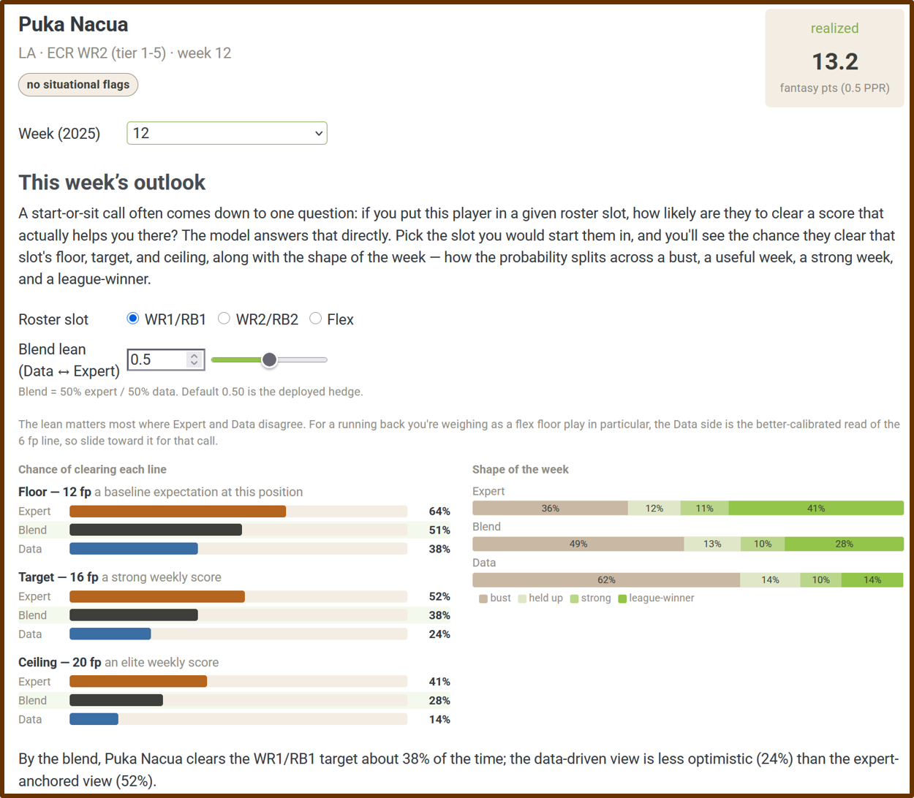
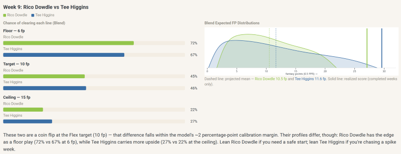
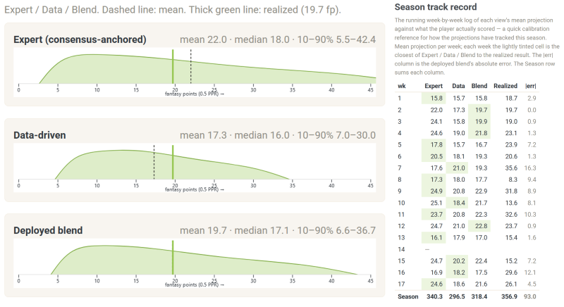
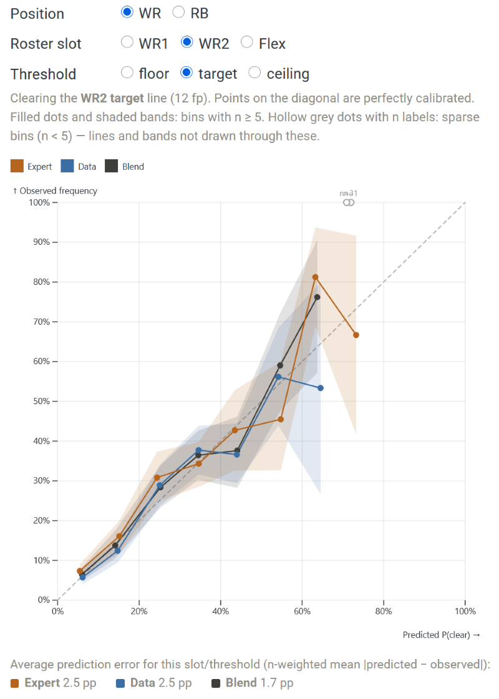
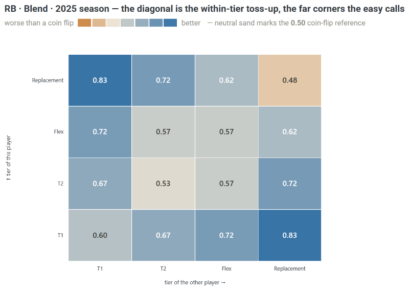

<!-- HERO IMAGE — a single player's projection on FFHedge: the "shape of the week"
     distribution with the floor/target/ceiling bars, so the first thing a reader
     sees is a distribution rather than "14.2." Source: ffhedge.com player explorer. -->

I have been playing fantasy football since we drafted by email and checked the newspaper for box scores, and after all these years I still run the same small calculation every Sunday morning.[^cred] I start with where the experts have a player ranked, because a consensus of dozens of analysts is hard to beat and I have learned, repeatedly and sometimes painfully, not to bet against it lightly. Then I nudge it with what the numbers say; his snaps have been climbing, the matchup is brutal, his quarterback is hurt. Somewhere in that informal weighing of the consensus against the data I land on a start-or-sit decision I can live with.

Over the past few weeks, I finally built the thing that does that weighing for me, out in the open, and put it online: [FFHedge](https://ffhedge.com). It projects weekly fantasy points for wide receivers and running backs, and it does the one thing I wished the other projection tools would do. It tells me how *uncertain* it is, and it tells you when your guess is as good as the prediction.

[^cred]:
    In my earliest leagues we emailed in our draft picks and waited for the newspaper to find out who won the week. I have the trophies and the grudges to prove I have been at this a while, which is the only credential I am claiming here.

## What it offers that most projections don't

There is no shortage of fantasy projections. Every major site will hand you a ranking (RB9), and some will even give you a number or two representing projected points (e.g., mean = 14.2 points, SD = 4.6). Experts place a [premium on maximizing the accuracy](https://www.fantasypros.com/about/faq/football-inseason-accuracy-methodology/) of these predictions, and they [tend to be reasonably accurate](https://fantasyfootballanalytics.net/2016/04/accuracy-of-rankings-vs-projections.html) [in the aggregate](https://blog.devgenius.io/ml-model-evaluation-measuring-the-accuracy-of-espn-fantasy-football-projections-in-python-9c81780b1625). Now, I know how to read these numbers, and how not to. After all, I [teach](https://reluctantcriminologists.com/course-materials/1_ugrad_stats/) and [write about](https://reluctantcriminologists.com/blog-posts/016/part1-mean-meaningless) statistics in my day job, and I've even [warned people](https://www.linkedin.com/posts/jrbrauer_an-influential-research-program-finds-a-correlation-activity-7447293791969087488-8Py3?utm_source=share&utm_medium=member_desktop&rcm=ACoAABXvTXYBHnh4akFwbxuIL8Bw8xtqhHR2CSc) not to place too much faith in aggregate statistical success metrics because they often hide a lot of individual-level predictive failures (I call this a [correlation paradox](https://osf.io/preprints/socarxiv/n4xuf_v4)). Case-in-point? I have two decades of watching "safe" starts lay eggs while unheralded players have boom weeks on my bench. And yet, even I visit my favorite ranking sites each week and treat their confidently published predictions like an oracle as I set my lineup. 

Don't mistake me here. I love those sites, and I couldn't have created my site [without them](https://www.fantasypros.com/). But I don't think we need another list of confident numbers. I built this site because I really wanted a list of painfully honest ones. 

So FFHedge gives you four things the confident-number tools mostly don't: 

- It gives you a *distribution* instead of a point, the whole shape of a player's week, the chance he busts, the chance he is useful, the chance he goes off, because a single number hides exactly the risk you are trying to weigh. 
- It keeps the *experts and the data side by side*, as an "Expert" view and a "Data" view, with a transparent blend of the two (and the option to change the blend yourself), rather than dissolving them into one opaque figure. 
- It reports its projections as *probabilities you can act on*, the chance a player clears a score (floor, target or ceiling) that actually helps you, rather than a rank. 
- And, perhaps most unusually, it *scores itself in public:* one page does nothing but track how well its own probabilities have held up, and another will tell you, to your face, when a decision is really just a coin flip.

That last part is the whole point. Understandably, most projection tools sell confidence; I wanted mine to give calibrated humility, which is less satisfying but (hopefully) considerably more useful when you are the one setting the lineup.

## The three ideas it runs on

Under the hood are three ideas borrowed from Bayesian statistics. None of them takes any math to use, and each buys you something concrete.

**Think in probabilities, not point guesses.** [Nate Silver's](https://www.natesilver.net/t/interactive) standing advice to any forecaster, in [*The Signal and the Noise*](https://www.penguinrandomhouse.com/books/305826/the-signal-and-the-noise-by-nate-silver/), is to stop issuing single confident numbers and start thinking in distributions, and weekly fantasy scoring is a perfect place to take it. A receiver who projects for "ten points" might be a steady floor play who lands between eight and twelve most weeks, or a boom-or-bust dart that goes for two or for twenty-six. Those are completely different players to start, and their identical averages hide it. [FFHedge](https://ffhedge.com) shows you the shape, a floor, a ceiling, and the chance of clearing each, so the risk sits on the table instead of buried in a single number (mean or ranking).

<!-- IMAGE BREAK — a player's full distribution / "shape of the week" panel, or a
     boom-bust vs steady comparison, to make "two players, same average, different
     shapes" concrete. Source: ffhedge.com player explorer (a volatile WR is ideal). -->

**Hedge two models instead of picking one.** I did not want to settle the old argument between trusting the experts and trusting the numbers, so I didn't. I built two separate models, one that sees only the expert consensus and one that sees only a player's usage and game environment, let each make its case as a full forecast, and combined them by a method called stacking, which weights each model by how well it has *actually predicted* in the past rather than by how good its story sounds.[^stacking] What that buys you is the freedom not to guess, in advance, whether the experts or the data will land closer this week; the blend hedges between them, and because it keeps both halves visible, you can see exactly where the two signals disagree and decide for yourself whether that disagreement is worth acting on. It is the reason the site is called FFHedge.

<!-- IMAGE BREAK — the Expert / Data / Blend head-to-head for a real start/sit
     (e.g., the Meyers-vs-Hunter Week 2 "Blend" panel), so the reader sees the two
     signals and the hedge between them. Source: existing screenshot at
     ffbayes-autonomous/dashboard/images/wk2-meyers-hunter-blend.jpg -->

**Check yourself on data you haven't seen.** A projection is only worth what it is worth on a game that has not happened yet, so the rigorous test requires predicting a season you have walled off and never looked at. I locked away the entire 2025 season while building the model, predicted it cold, and then scored the result, and the site keeps that [scorekeeping public](https://ffhedge.com/methodology#holdout-discipline-pre-registration-and-evaluating-predictions). When the model says a player has a 40% chance to clear a line, players in that bucket clear it about 40% of the time; across the board the stated probabilities are off by only a couple of percentage points. That is what lets you trust the numbers. They have been checked, in the open, against outcomes the model never got to see, which is a far higher bar than merely sounding right. I also plan to carry the process live into the 2026 season, so we can witness the hits and misses together.  

[^stacking]:
    The combination method is stacking ([Yao, Vehtari, Simpson & Gelman, 2018](https://doi.org/10.1214/17-BA1091)), and the models are fit in [brms](https://paulbuerkner.com/brms/). The full machinery — the two distributional families, the priors, the scoring rules, and a pre-registered test of the whole thing on the held-out 2025 season — is on the site's [methodology page](https://ffhedge.com/methodology.html) for anyone who wants it.

## How good is it, really?

Here is the part many projection tools will never fully show you: how good they actually are. [Some do](https://fantasyfootballanalytics.net/2017/03/best-fantasy-football-projections-2017.html), but the metrics can often be hard to understand if you are not a data analyst yourself. [FFHedge](https://ffhedge.com) shows you, and it aims for a valid answer. For example, like most ranking tools, its predictions are good at the easy calls and no better than a coin flip on the hard ones.

Moreover, the standard is to score accuracy using aggregate predictive metrics (e.g., [MAE](https://ffhedge.com/calibration#does-the-hedge-lower-error-over-the-long-run)); few systematically track and publish their [hits and misses at the individual level](https://ffhedge.com/reality-check). Start a clearly startable player over someone you would grab off waivers, and the model picks the higher scorer three times out of four or better. This is genuinely useful on the most common decision you face but, if you have read this far, you probably don't need a tool for those; the tool earns its keep on the uncertainty, not the easy pick. Ask it to separate two players the consensus already rates as roughly equals - you know, the agonizing Sunday-morning toss-up - and it falls to a coin flip. Then again, so does every other model, and so do the raw expert rankings (I checked). And if you want to know who is going to *erupt* for thirty this week? Well, join the club - no one can tell you, because that one is a coin flip for everybody.

<!-- IMAGE BREAK — the Reality-check tier grid (start/sit scorecard): green corners
     (stud over replacement) and a coin-flip diagonal (within-tier toss-ups).
     Source: ffhedge.com Reality-check page. -->

I find that honesty clarifying rather than discouraging, and not only as a fantasy player. In my day job studying prediction in criminology, the same pattern turns up everywhere. As I mentioned earlier, a model can look impressive in the aggregate and still be close to useless on the individual case that actually matters, and telling those two apart takes the kind of strict, one-decision-at-a-time individual-level test the grid above is running.[^crim] I even managed to fool myself at one point with a textbook selection error, flagging a follow-up exploratory result using an outcome I should not have peeked at, the very mistake I have [written about](https://reluctantcriminologists.com/blog-posts/%5B5%5D/colliders) in other people's work, before catching it and reporting a much humbler conclusion. A fantasy tool that will admit, on its own front page, where it is no better than a coin is doing something I wish more prediction did.

[^crim]:
    The academic version: a paper [Jake Day and I wrote](https://doi.org/10.1007/s11186-025-09645-z) argues that social science leans too hard on aggregate statistics that can hide individual-level prediction failures, something we call a "precision crisis." Fantasy football turned out to be a weirdly ideal sandbox for those ideas, with none of the stakes.

## Before Sunday

So that is [FFHedge](https://ffhedge.com): weekly projections that aim for valid probabilities, a transparent hedge between the experts and the data, and a scorecard that owns its own limits. Check it out, send feedback, tell me if you think the proof-of-concept is useful and worth expanding. 

If there is a thesis buried in all of this, it is that honest prediction is rarer, and more useful, than confident prediction, in fantasy football and well beyond it. I would rather a forecast look me in the eye and say "coin flip" than sell me a certainty it has not earned.[^name] Most weeks, and for many real-world decisions, that honesty is the most useful thing a projection can give you.

[^name]:
The name is intended to be a bit playfully ironic: You might not get much of an **edge** with FFH**edge**, but you'll have more information. And who knows - maybe you'll beat yourself up a bit less on some tough decisions, or take it out on a coin instead.

